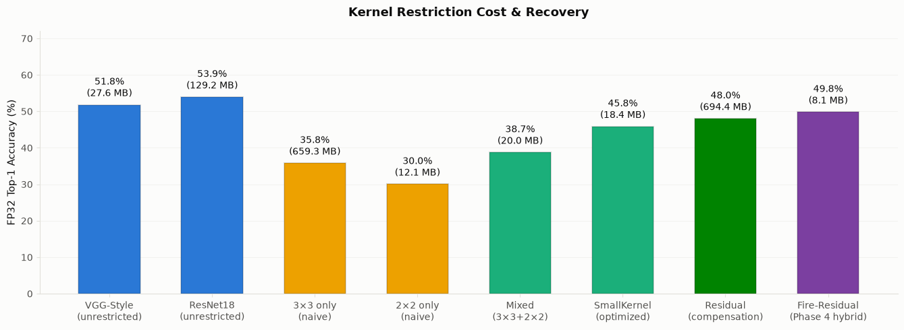
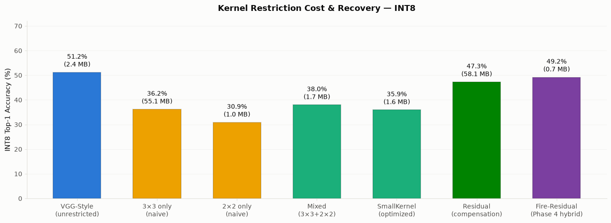
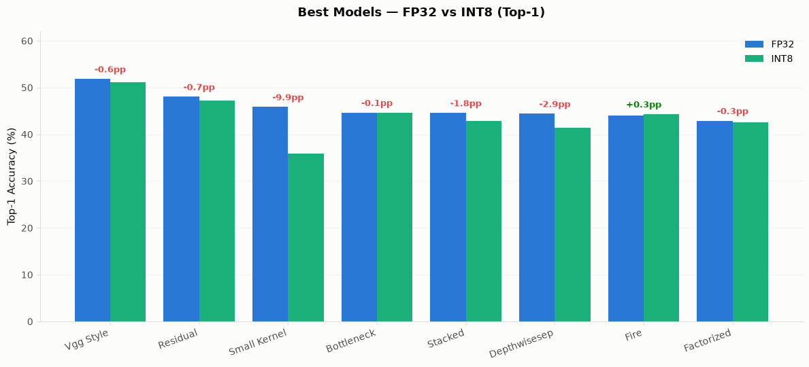
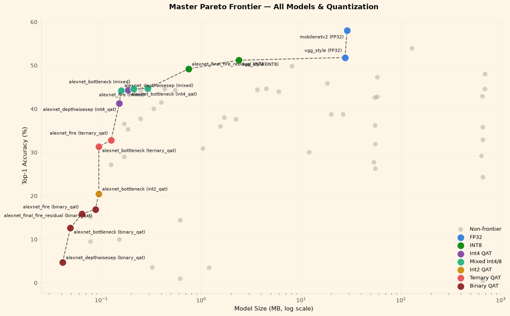
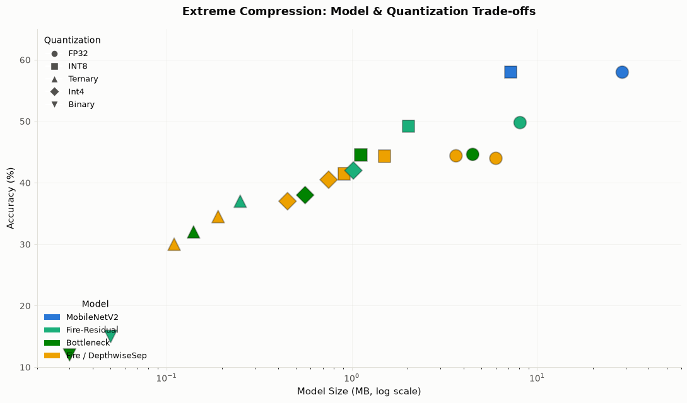

<!-- Title Slide -->
# Restrição do Tamanho de Kernel em CNNs e Sua Eficiência

Rafael Silva de Souza

---

## Experimentos

- **Dataset:** Tiny ImageNet-200 (64×64 RGB, 200 classes) [1]
- **Pipeline:** Treinamento FP32 → ajuste fino QAT [2] → inferência INT8 via fbgemm [3], em PyTorch [4]
- **Escopo:** 4 fases, mais de 25 variantes de arquitetura

---

## Motivação: Por Que o Tamanho do Kernel Importa

**O problema:** A convolução acelerada por Winograd [5] atinge alta eficiência para kernels pequenos (2×2, 3×3), mas escala mal para filtros grandes.

**Pergunta:** É possível trocar tamanho de kernel por eficiência em aceleradores Winograd sem sacrificar a acurácia? Quão robusta é essa troca sob quantização?

---

## Design da Pesquisa

| Fase | Foco | Modelos-Chave |
|-------|-------|-----------|
| **1** | Baselines pré-treinados | MobileNetV2 [6], ResNet18 [7], VGGStyle [8], AlexNet [9] |
| **2** | Restrição de kernel | AlexNet 3×3, 2×2, SmallKernel (otimizado) |
| **3** | Mecanismos de compensação | Bottleneck [7], Fire [10], Residual [7], DepthwiseSep [11] |
| **4** | Arquiteturas híbridas finais | Fire-Residual, Bottleneck-Fire (FP32 + compressão extrema) |

---

## A Restrição de Kernel

---

## Equivalentes em INT8

*ResNet18 omitido — não existe resultado INT8/QAT para esse baseline pré-treinado.*

---

## Comparação

|  | **SmallKernel** | **Residual** |
|---|---|---|
| Mecanismo | Canais mais estreitos (64→128→256→256→256) + cabeça GAP no lugar das FC 4096+4096 + camadas 3×3 para compensar o campo receptivo | 5 blocos residuais [7]: duas conv 3×3+BN+ReLU somadas ao atalho via `FloatFunctional`; canais e cabeça FC iguais ao `AlexNet3x3` |
| Parâmetros | 1,6M | 57,8M |
| Tamanho | **18 MB** | 694 MB |
| FP32 → INT8 | 45,8% → 35,9% | **48,0% → 47,3%** |

**Leve, porém frágil na quantização** — vs. — **Pesado, porém o mais preciso e estável**

---

## Compração FP32 vs. INT8

---

## Melhores Modelos (até o momento)

---

## Compressão Extrema

---

## Referências

**[1]** LE, Y.; YANG, X. *Tiny ImageNet visual recognition challenge*. Stanford: CS231N Course Technical Report, 2015.

**[2]** JACOB, B. et al. *Quantization and training of neural networks for efficient integer-arithmetic-only inference*. In: IEEE CONFERENCE ON COMPUTER VISION AND PATTERN RECOGNITION, 2018, Salt Lake City. Proceedings [...]. Piscataway: IEEE, 2018. p. 2704-2713.

**[3]** KHUDIA, D. et al. *FBGEMM: enabling high-performance low-precision deep learning inference*. arXiv preprint arXiv:2101.05615, 2021.

**[4]** PASZKE, A. et al. *PyTorch: an imperative style, high-performance deep learning library*. In: ADVANCES IN NEURAL INFORMATION PROCESSING SYSTEMS, 32., 2019, Vancouver. Proceedings [...]. 2019. p. 8024-8035.

---

## Referências (cont.)

**[5]** LAVIN, A.; GRAY, S. *Fast algorithms for convolutional neural networks*. In: IEEE CONFERENCE ON COMPUTER VISION AND PATTERN RECOGNITION, 2016, Las Vegas. Proceedings [...]. Piscataway: IEEE, 2016. p. 4013-4021.

**[6]** SANDLER, M.; HOWARD, A.; ZHU, M.; ZHMOGINOV, A.; CHEN, L. *MobileNetV2: inverted residuals and linear bottlenecks*. In: IEEE CONFERENCE ON COMPUTER VISION AND PATTERN RECOGNITION, 2018, Salt Lake City. Proceedings [...]. Piscataway: IEEE, 2018. p. 4510-4520.

**[7]** HE, K.; ZHANG, X.; REN, S.; SUN, J. *Deep residual learning for image recognition*. In: IEEE CONFERENCE ON COMPUTER VISION AND PATTERN RECOGNITION, 2016, Las Vegas. Proceedings [...]. Piscataway: IEEE, 2016. p. 770-778.

**[8]** SIMONYAN, K.; ZISSERMAN, A. *Very deep convolutional networks for large-scale image recognition*. In: INTERNATIONAL CONFERENCE ON LEARNING REPRESENTATIONS, 3., 2015, San Diego. Proceedings [...]. 2015.

---

## Referências (cont.)

**[9]** KRIZHEVSKY, A.; SUTSKEVER, I.; HINTON, G. E. *ImageNet classification with deep convolutional neural networks*. In: ADVANCES IN NEURAL INFORMATION PROCESSING SYSTEMS, 25., 2012. Proceedings [...]. p. 1097-1105.

**[10]** IANDOLA, F. N. et al. *SqueezeNet: AlexNet-level accuracy with 50x fewer parameters and <0.5MB model size*. arXiv preprint arXiv:1602.07360, 2016.

**[11]** HOWARD, A. G. et al. *MobileNets: efficient convolutional neural networks for mobile vision applications*. arXiv preprint arXiv:1704.04861, 2017.

---

## Obrigado
