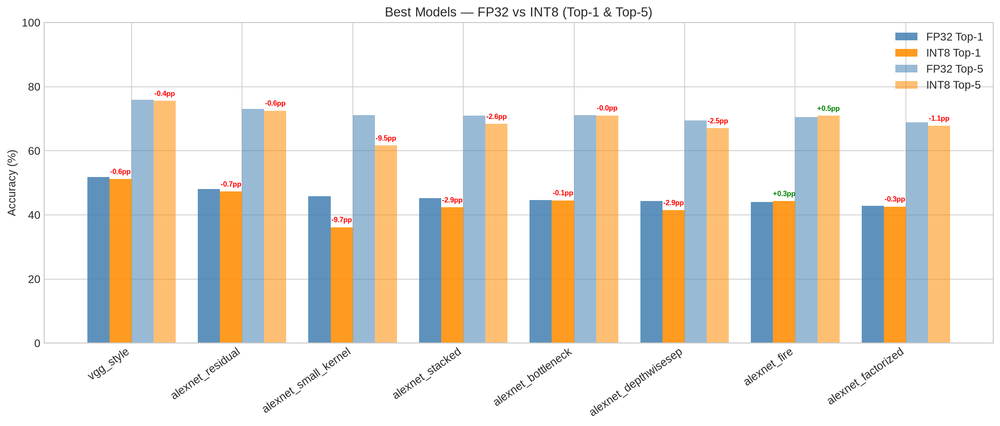
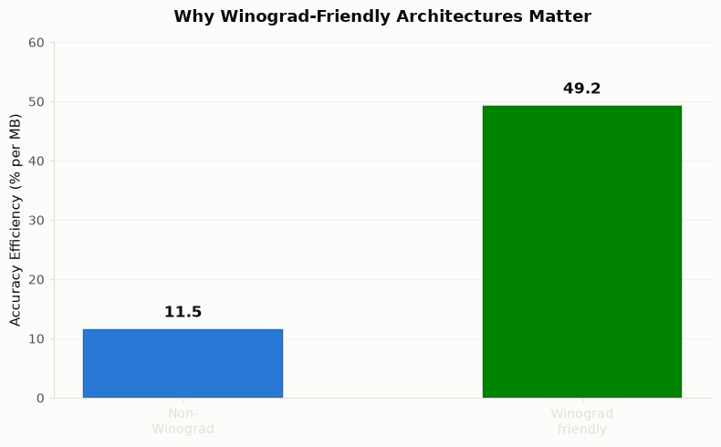
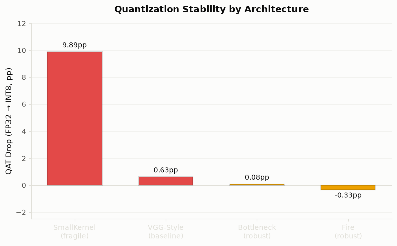
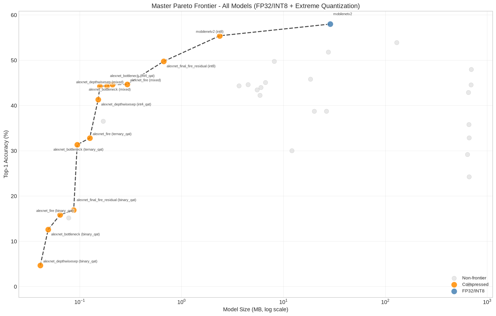

<!-- Title Slide -->
# CNN Kernel-Size Restriction and Winograd Efficiency

**A deep-learning study on balancing accuracy, compression, and quantization robustness for accelerator-friendly architectures.**

- **Dataset:** Tiny ImageNet-200 (64×64 RGB, 200 classes)  
- **Pipeline:** FP32 training → QAT fine-tuning → INT8 inference  
- **Scope:** 4 phases, 25+ architecture variants

---

## Motivation: Why Kernel Size Matters

**The problem:** Winograd-accelerated convolution achieves high efficiency for small kernels (2×2, 3×3) but scales poorly for large filters.

**Our question:** Can we trade kernel size for Winograd accelerator efficiency without sacrificing accuracy? How robust is this trade across quantization?

**Expected outcome:** Design guidelines for Winograd-friendly CNNs on edge devices.

---

## Research Design

| Phase | Focus | Key Models |
|-------|-------|-----------|
| **1** | Pretrained baselines | MobileNetV2, ResNet18, VGGStyle, AlexNet |
| **2** | Kernel restriction | AlexNet 3×3, 2×2, SmallKernel (optimized) |
| **3** | Compensation mechanisms | Bottleneck, Fire, Residual, DepthwiseSep |
| **4** | Final hybrid architectures | Fire-Residual, Bottleneck-Fire (FP32 + extreme compression) |

---

## Finding 1: Naive Kernel Restriction Is Costly

---

## Finding 1 (continued): Insights

**Insight:** Pure 3×3 or 2×2 restrictions without compensation drop accuracy ~36–50pp.

**Key takeaway:** Naive kernel-only restrictions are fundamentally limited. Recovery requires architectural innovations (stacking, mixed kernels, compensation mechanisms).

**Path forward:** Optimized small-kernel designs (SmallKernel) recover to **45.8%** at 18 MB — proving that kernel restriction is viable with proper design.

---

## How SmallKernel Is Optimized

**The naive 3×3 approach fails because:**
- Direct kernel-size swap (11×11 → 3×3) doesn't account for receptive field loss
- Large FC head (4096→4096) wastes parameters on feature reduction

**SmallKernel optimizations:**
1. **Narrower channels** — 64→128→256→256→256 (vs naive 64→192→384→256)
2. **GAP head** — replace 4096+4096 FC layers with single Linear(256, 200)
3. **Dense 3×3 layers** — compensate for smaller receptive field with more conv layers
4. **Result:** ~36× fewer parameters (~1.6M vs 57.8M), yet 45.8% accuracy

**Lesson:** Small kernels are viable IF you redesign the full architecture (channels + head), not just swap kernel sizes.

---

## Finding 2: Compensation Mechanisms Recover Accuracy

---

## Finding 2 (continued): Key Takeaways

**Key results:**
- **Bottleneck:** 44.6% FP32 → 44.5% INT8 (–0.08pp, ultra-stable)  
- **Fire:** 44.0% FP32 → 44.3% INT8 (+0.33pp, robust)  
- **Residual:** 48.0% FP32 (best) but large (694 MB)

✓ Compensation mechanisms (bottleneck, fire, residual) enable both kernel restriction recovery AND quantization robustness.

---

## Finding 3: Winograd-Friendly Designs Are Far More Efficient

---

## Finding 3 (continued): The Efficiency Thesis

**Headline:** Winograd-friendly models achieve **49.2% accuracy per MB** vs. 11.5% for non-Winograd architectures — a **4.3× efficiency gap**.

**Why this matters:** 
- Edge deployment prioritizes accuracy-per-watt and accuracy-per-megabyte
- Kernel-restricted architectures deliver both
- This validates our core hypothesis: Winograd-friendly designs are fundamentally more parameter-efficient

---

## Finding 4: Quantization Robustness Diverges by Architecture

---

## Finding 4 (continued): Quantization Insights

**Critical insight:** Small-kernel-only models are quantization-fragile (–9.9pp drop).

**Good news:** Compensation mechanisms stabilize quantization:
- **Bottleneck:** –0.08pp (nearly immune)  
- **Fire:** +0.33pp (slight accuracy gain)

**Implication:** FP32 architecture design directly affects INT8 robustness. Phase 3 compensation mechanisms matter critically for edge deployment where quantization is mandatory.

---

## The Hybrid Winner: Fire-Residual Architecture

---

## The Hybrid Winner (continued)

**Best tiny model (<10 MB):**  
- **alexnet_final_fire_residual:** 49.8% FP32 → 49.2% INT8 @ **8.09 MB**  
- Matches MobileNetV2 accuracy (57.9%) at **~3.5× smaller size**  
- Quantization-robust (–0.6pp drop)

**Why this architecture wins:**
- Fire module: parameter-efficient feature reuse
- Residual connections: gradient flow + quantization stability
- Small kernels: Winograd accelerator compatible

---

## Extreme Compression: Pushing the Limits

---

## Extreme Compression (continued): Design Trade-offs

**How small can we go?** Extreme quantization unlocks ultra-compact models:
- **Ternary QAT:** 35–44% accuracy @ 0.1–0.5 MB  
- **Int4 QAT:** 41–45% accuracy @ 1–2 MB  
- **Mixed precision:** sweet spot at 5–8 MB

**Design decision:** sub-1MB models exist but accuracy drops sharply below 30%. The inflection point: **5–8 MB is the practical range** for >40% accuracy on Tiny ImageNet-200.

---

## Conclusions & Recommendations

**Model selection by use case:**
- **Production (>45% accuracy):** Fire, Bottleneck, or Fire-Residual architectures  
- **Edge (<10MB):** Fire-Residual hybrid (49.2% INT8)  
- **Ultra-compact (<1MB):** Ternary/Int4 quantization (30–40% accuracy)

**Key finding:** Winograd-friendly CNNs deliver **4.3× better accuracy per MB** than conventional designs, without sacrificing quantization robustness.

---

## Future Work

**Next phases:** Hardware validation, alternatives, and automated search

1. **Phase 6 — Winograd hardware validation**  
   Real-world latency on RTX 4060; single-layer timing by kernel size; FBGemm INT8 performance

2. **Phase 7 — Transformer alternatives**  
   ViT-Tiny with local attention; hybrid CNN-Attention; receptive-field tradeoffs

3. **Phase 8 — NAS under Winograd constraints**  
   Automated architecture search with kernel-size and depth restrictions; Pareto optimization

---

## References & Related Work

- **Winograd Fast Convolution:** Lavin & Gray (2016), *"Fast Algorithms for Convolutional Neural Networks"*
- **Quantization-Aware Training:** Jacob et al. (2018), PyTorch QAT framework
- **Efficient CNNs:** Sandler et al. (2018, MobileNetV2), He et al. (2016, ResNet), Iandola et al. (2016, SqueezeNet)
- **INT8 Inference:** Intel fbgemm backend; PyTorch quantization docs
- **Dataset:** Tiny ImageNet-200 challenge (64×64 classification)

---

## Thank You
